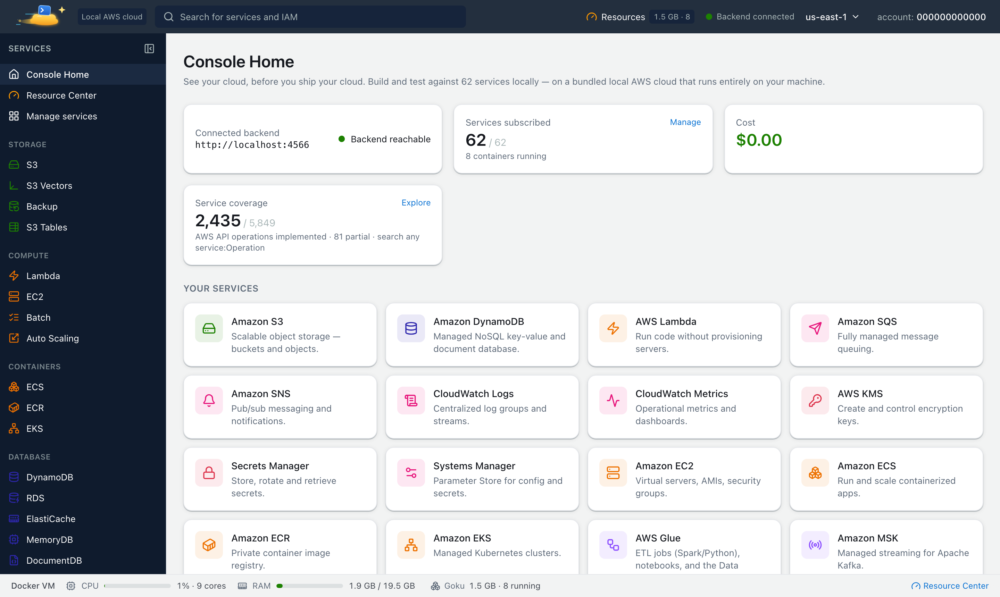

<p align="center"></p>

<h1 align="center">Goku: a free local AWS emulator with a web console</h1>

<p align="center">
Run S3, Lambda, DynamoDB, RDS, SQS, SNS, Step Functions, API Gateway, Glue, ECS, EKS and 60+ other AWS services<br>
on your own machine: 73 AWS-compatible services, a web console for 60 of them, no AWS account and no bill.<br>
<em>Formerly Mimir.</em>
</p>

<p align="center">
  <a href="https://tanuj24.github.io/goku/"></a>
  <a href="https://hub.docker.com/r/tanujsoni027/goku"></a>
  <a href="https://github.com/tanuj24/goku/releases"></a>
  
</p>

<p align="center"></p>

## What is Goku?

Goku is a **local AWS cloud** for development, testing and learning. You get an AWS-compatible endpoint on
`http://localhost:4566` and a web console on `http://localhost:8080` that works like the AWS console. The AWS CLI, the
AWS SDKs, Terraform and the CDK talk to it without code changes: you only point them at the local endpoint.

Services run on **real engines**, not mocks:
- **RDS:** PostgreSQL, MySQL and MariaDB
- **ElastiCache and MemoryDB:** Valkey and Redis
- **DocumentDB:** MongoDB
- **Amazon MQ:** RabbitMQ and ActiveMQ
- **Glue and EMR Serverless:** Spark
- **EKS:** k3s
- **Lambda and ECS:** real containers

People use it to:
- **run AWS locally** while they build, with no cloud account and nothing to pay;
- **test AWS code** in integration tests and CI without touching a real account;
- **test and debug Lambda functions locally**, stepping through them from VS Code, IntelliJ, PyCharm or GoLand;
- **learn AWS** hands-on, with sample data on every service page.

## Install

macOS and Linux:

```bash
curl -fsSL https://tanuj24.github.io/goku/install.sh | sh
goku start
```

Windows (PowerShell):

```powershell
irm https://tanuj24.github.io/goku/install.ps1 | iex
goku start
```

`goku start` runs Goku in Docker and opens the console. Then point your tools at it:

```bash
eval "$(goku env)"          # sets AWS_ENDPOINT_URL, AWS_REGION and local credentials
aws s3 mb s3://my-bucket
aws dynamodb list-tables
```

With plain Docker instead:

```bash
mkdir -p ~/.goku/data
docker run -d --name goku -p 8080:80 -p 4566:4566 -p 5500-5524:5500-5524 \
  -v /var/run/docker.sock:/var/run/docker.sock -v ~/.goku/data:/app/data \
  -v /tmp/goku-glue:/tmp/goku-glue tanujsoni027/goku:latest
```

The [install guide](https://tanuj24.github.io/goku/install.html) covers every option, including upgrades and troubleshooting.

## AI assistants (MCP)

Goku serves the Model Context Protocol at `http://localhost:8080/mcp` (Streamable HTTP), so Claude Code, Claude
Desktop, Cursor, VS Code, Windsurf and other MCP clients can work with your local AWS: 25 tools, including
`aws_call` for any operation of the emulated AWS services. Everything they change stays on your machine; nothing
reaches real AWS.

```bash
claude mcp add goku -- goku mcp                                  # Claude Code; goku mcp starts Goku if it isn't running
claude mcp add --transport http goku http://localhost:8080/mcp   # or over HTTP, while Goku runs
goku mcp config cursor                                           # the setup for claude-desktop, cursor, vscode or windsurf
```

Requests from other websites are refused, and `GOKU_MCP=off` turns the endpoint off. The
[MCP guide](https://tanuj24.github.io/goku/mcp.html) has the setup for every client and the full tool list.

## Features

- **73 AWS-compatible services and 60 console pages.** They include:
  - S3, DynamoDB, Lambda, SQS, SNS, EventBridge and Step Functions
  - API Gateway, RDS, ElastiCache, OpenSearch, Kinesis and MSK
  - ECS, EKS, ECR, Glue, Athena, Redshift and Cognito
  - IAM, KMS, Secrets Manager, CloudWatch and CloudFormation
- **AWS Lambda:** every current runtime on arm64 and x86_64, plus step-through debugging and response streaming.
- **AWS Glue 6.0 and 5.1:** real PySpark jobs and notebooks, and the Data Catalog.
- **DynamoDB:** vector search, a PartiQL editor and an item explorer.
- **IAM Policy Lab:** see who gains or loses access before you ship an IAM change.
- **Developer tools:**
  - environment snapshots
  - fault injection
  - least-privilege IAM from real activity
  - request journeys
  - Terraform, CDK and Pulumi support
- **Everything on disk:** all data, databases included, lives in `~/.goku/data`, so it survives restarts, updates and Docker resets.
- **Updates from the console:** one click, with automatic rollback. `goku update` does the same from a terminal.
- **Runs everywhere:** macOS (Apple Silicon and Intel), Linux and Windows, from one multi-arch image.

## Guides

- [How to run AWS locally without an AWS account](https://tanuj24.github.io/goku/run-aws-locally.html)
- [Test and debug AWS Lambda locally](https://tanuj24.github.io/goku/test-aws-lambda-locally.html)
- [Run DynamoDB locally](https://tanuj24.github.io/goku/dynamodb-local.html)
- [Run AWS Glue jobs locally](https://tanuj24.github.io/goku/aws-glue-locally.html)
- [Connect AI assistants to local AWS with MCP](https://tanuj24.github.io/goku/mcp.html)

## Mimir is now Goku

Goku was called **Mimir**, and every name is Goku now:
- the image `tanujsoni027/goku`;
- the container `goku`;
- `GOKU_*` settings;
- the `goku` command.

`goku update` moves an existing Mimir install over, data and all. The old names keep working for now. See
[old and new names](https://tanuj24.github.io/goku/install.html#names).

## FAQ

**Is Goku free?** Yes, all of it.

**Do I need an AWS account?** No. Everything runs locally.

**Can I use it in CI?** Yes. It runs anywhere Docker runs, and the image starts in seconds.

**Is it a replacement for AWS in production?** No. It's a local development and testing environment.

## Links

- 🌐 Website: https://tanuj24.github.io/goku/
- 🐳 Docker Hub: https://hub.docker.com/r/tanujsoni027/goku
- 🐛 Bug reports and feature requests: [Issues](https://github.com/tanuj24/goku/issues)
- 📦 goku CLI downloads: [Releases](https://github.com/tanuj24/goku/releases)

Goku is free to use. It is an independent project and is not affiliated with or endorsed by Amazon Web Services.
